# Depth profiling application Guidebook
## Introduction
The goal of this application is to analyze images acquired in the frame of the Focused Ion Beam-Digital Image Correlation (FIB-DIC) technique ([Korsunsky et al., 2010](https://doi.org/10.1016/j.surfcoat.2010.09.033)). The analysis process consists in (optionally) filtering the images, defining markers, analyzing the displacements of the markers, estimating the strain and finally calculating residual stress. Those steps were tailored to the needs of the developers and might not be suited for any analysis. For example, only the ring-core milling geometry was investigated during tests.

Some of the functionalities presented here are based on a previous [application developed](https://mathworks.com/matlabcentral/fileexchange/) in the frame of the [iStress project](https://cordis.europa.eu/project/id/604646) by Melanie Senn and Christoph Eberl. This original application allowed to analyze DIC markers and to calculate a value of residual stress for the entire volume milled. However, the code written at that time is presently outdated given the evolution of Matlab from [GUIDE to App Designer](https://mathworks.com/products/matlab/app-designer.html). Moreover, the large number of user prompts made it hard to streamline the whole analysis process. The application presented here brings some changes to the original code and includes the possibility to follow the evolution of residual stress over depth, or residual stress depth profiling, based on code written by Enrico Salvati.

## General analysis process
A typical FIB-DIC analysis goes as follows:
1. Milling & image acquisition
2. Image processing (optional)
3. Strain analysis
    1. Markers definition
    2. Calculation of the displacements
    3. Manual removal of markers
4. Stress calculation
5. Advanced functions (optional)
    1. Averaging of multiple residual stress profiles
    2. Comparison between curves

## Image acquisition
The [FIB-DIC Good practice guide](https://eprintspublications.npl.co.uk/7807/) recommends to take multiple images during after every milling step and to average them.

The diagram below represents the three potential scan directions used during image acquisition: 0°, 45° and 90°. 

<center>
    <figure>
        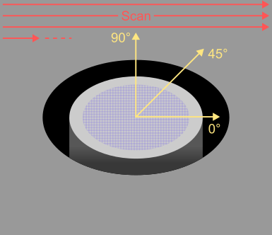
        <figcaption>
            Scan directions
        </figcaption>
    </figure>
</center>

## File management
The general structure of files is shown in the following tree:
```
sample
└───pillar
    └───series1
        ├───raw
        │   └───0
        │   └───45
        │   └───90
        ├───processed**
        │   └───0
        │   └───45
        │   └───90
        └───results**
            └───depth_profiling**
```
\* Optional directories.  
\** These directories will be created automatically after relevant functions have been executed unless they already exist.

### Creating new images
The user can either perform their analysis on the images they acquired or create new ones by rotation. The application will read the name of the 'raw' folder and create a 'processed' folder accordingly during the image processing step. The folder creation is detailed in the table below.

| Raw images folder | Rotation? | Output folder |
| :-----------------: | :---------: | :-------------: |
| `raw/0` | No | `processed/0` |
| `raw/0` | 45° | `processed/45` |
| `raw/0` | 90° | `processed/90` |
| `raw/45` | No | `processed/45` |
| `raw/90` | No | `processed/90` |

The option of rotating images was added in case the user did not change the scan direction during the image acquisition, but still desires a biaxial analysis of stresses.

### Workfolder
The 'workfolder' shown below is the directory where all modified files are located, such as the analyzed images and the DIC files. It is generally located in `/sample/pillar/series/processed/0` (or `/45` or `/90`), as described in the section above.

<center>
    <figure>
        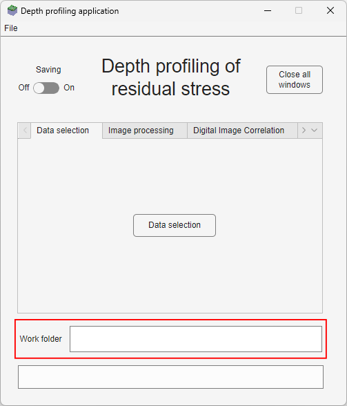
        <figcaption>
            Workfolder
        </figcaption>
    </figure>
</center>

## Tab by tab description
### Data selection
The data selection tab allows the user to choose the directory where their data is located. If a `Series directory` is selected, then the parent directory and its (grand-)parent directory are selected as well, which are named `Pillar directory` and `Sample directory` respectively. This is used for the advanced functions.

The direction of the images can also be chosen, depending on if the user made SEM images of the pillar in the 0°, 45°, and/or 90° scan direction(s).

<center>
    <figure>
        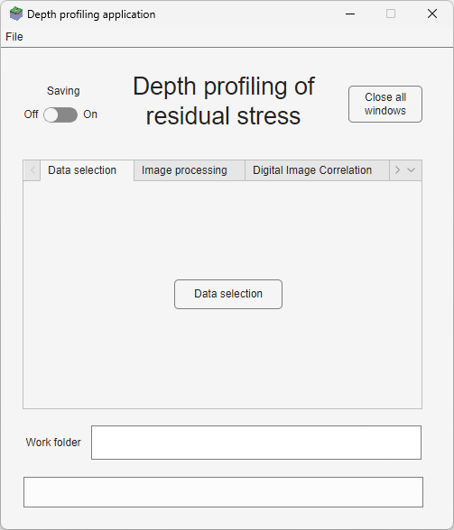
        <figcaption>
            Data selection tab
        </figcaption>
    </figure>
    <figure>
        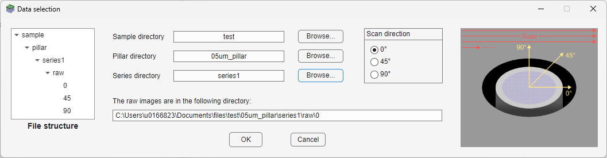
        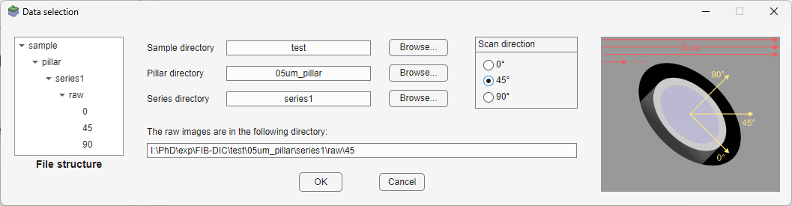
        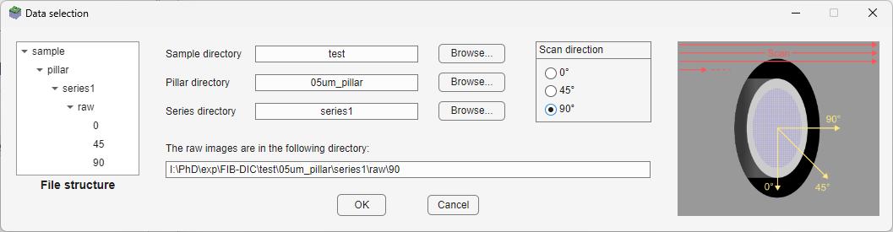
        <figcaption>
            Data selection
        </figcaption>
    </figure>
</center>

The application will try to find a raw folder with the images. If the folder does not exist, then the user cannot go further.

Selecting the data will also change the [workfolder](#files-structure) accordingly.

### Image processing
Image processing functions are disabled by default. They take a Fiji path and a series in input (see [Data selection](#data-selection)). The former can be selected in `File -> Fiji path`. This path is then automatically selected every time the user opens the application (the message box below the workfolder should confirm this). The user is prompted to select a Fiji path if they have not selected one before (this includes the first use of the application).

The image processing will be applied to the all the images of the specified format, in the workfolder.

The following operations are possible:
1. Crop (optional): The user can remove the bottom label of their SEM images if desired. They need to fill the image dimensions (i.e., without the bottom label).
2. Image rotation (optional): As described in [Creating new images](#creating-new-images), the user can create new images by rotating one set of images.
3. Additional filters: Two image processing options are included here.
    - Image registration using StackReg: To align all the images according to the procedure described by [Thévenaz et al.](https://bigwww.epfl.ch/publications/thevenaz9801.html)
    - Intensity averaging: To average the grayscale level of each pixel over a number of images given by the user. This type of processing is recommended in the [FIB-DIC Good practice guide](https://eprintspublications.npl.co.uk/7807/).

Generally, it is recommended to first align the images and then average them in order to account for drift between multiple images at the same step. Else, artificial blur might be created on the images.

<table>
    <tr>
        <td style="width:45%">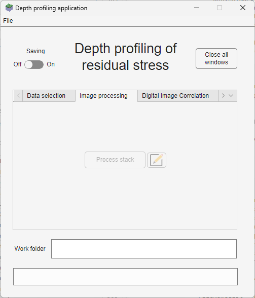</td>
        <td>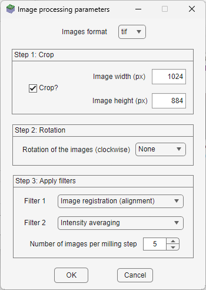</td>
    </tr>
</table>

### Digital Image Correlation
This part of the analysis comprised three steps as in the original DIC application, namely:

1. File list creation
2. Markers definition & Correlations processing
3. Displacement analysis

Those steps were kept the same here, with less prompts for the user. For example, the file list parameters window shown below makes it easier to create a file list for multiple series in a row by reducing the number of prompts to the user. The same principle applies to the process correlations parameters.

<center>
    <figure>
        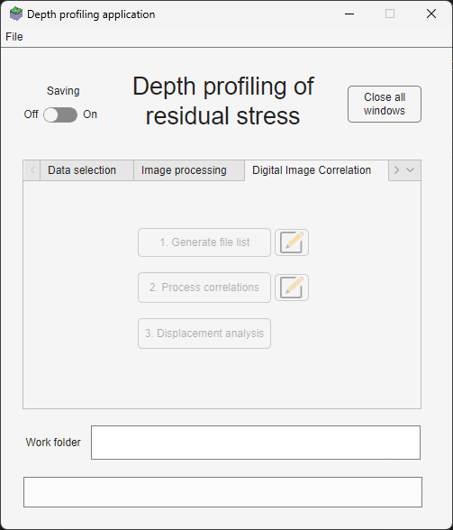
        <figcaption>DIC tab</figcaption>
    </figure>
    <table>
        <tr>
            <td>
                <figure>
                    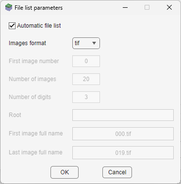
                    <figcaption>File list parameters</figcaption>
                </figure>
            </td>
            <td>
                <figure>
                    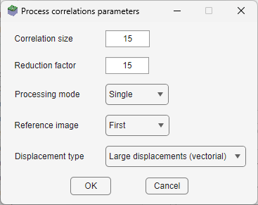
                    <figcaption>Process correlation parameters</figcaption>
                </figure>
            </td>
        </tr>
    </table>
</center>

The displacement analysis application was slightly changed as it was noted that the markers selection controls did not appear before.

<table>
    <tr>
        <td><figure>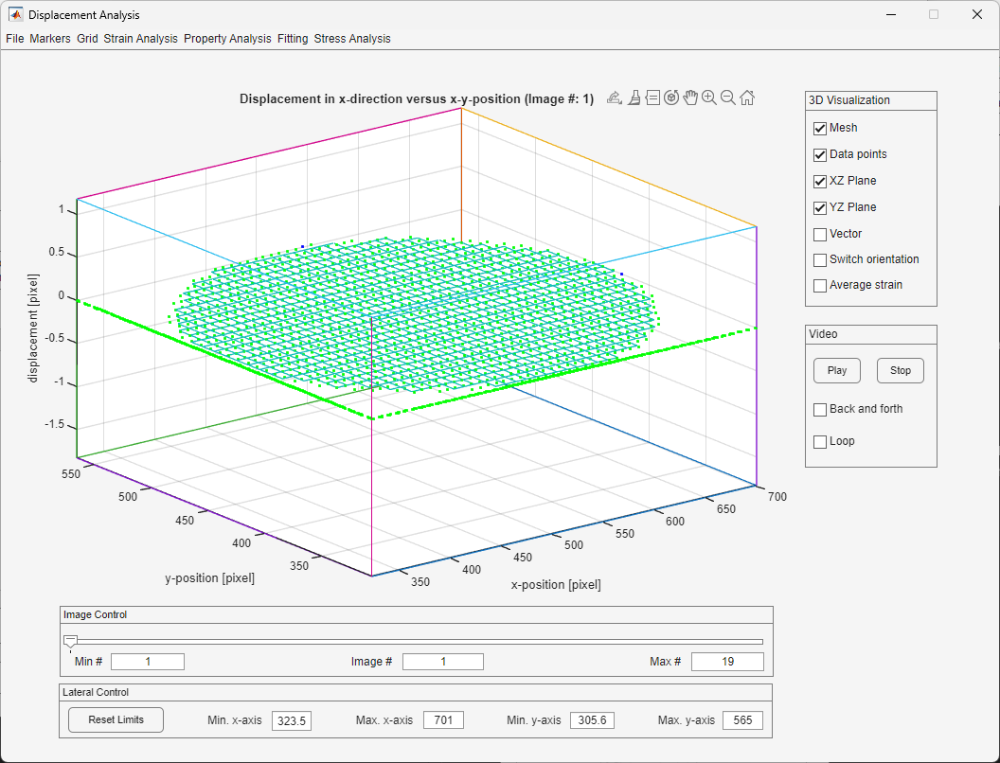<figcaption>Displacement Analysis application</figcaption></figure></td>
        <td></td>
    </tr>
</table>

### Depth profiling
Three types of depth profiling are possible, depending on the type of stress expected in the material:

| Stress state   | Strain files required           | Plotted stress profiles          |
| :------------: | :-----------------------------: | :------------------------------: |
| Equibiaxial    | One, in the 0° direction   | One, for the 0° direction   |
| Biaxial (with principal directions at 0° and 90°) | Two, in the 0° and 90° directions | Two, for the 0° and 90° directions |
| Biaxial (with unknown principal directions) | Three, in the 0°, 90° and 45° directions | Two, for both principal directions. The angle between the 0° direction and the first principal direction is also plotted. |

The user can also adjust parameters for depth profiling:
- Milling parameters (mandatory)
- Material properties (mandatory)
- Plot options:
    - $x$ axis data: choose whether to plot the residual stress as a function of depth (in µm) or of normalized depth (i.e., depth divided by pillar diameter).
    - Limits of the $x$ axis (depth or normalized depth) and of the $y$ axis (stress, in MPa)
- Strain curve smoothing parameters: A smoothing of strain is carried out before stress calculations (see [Korsunsky et al., 2018](https://doi.org/10.1016/j.matdes.2018.02.044)). The method used is a moving fitting of a number of points by a polynomial function. Both the points span and polynomial degree are changeable by the user. The depth profiling generates a strain curve and its associated smoothed curve so that the user can test those parameters.
- DIC parameters: It is possible to change the pillar reduction factor, which is set during the DIC analysis. 

<table>
    <tr>
        <td style="width:45%">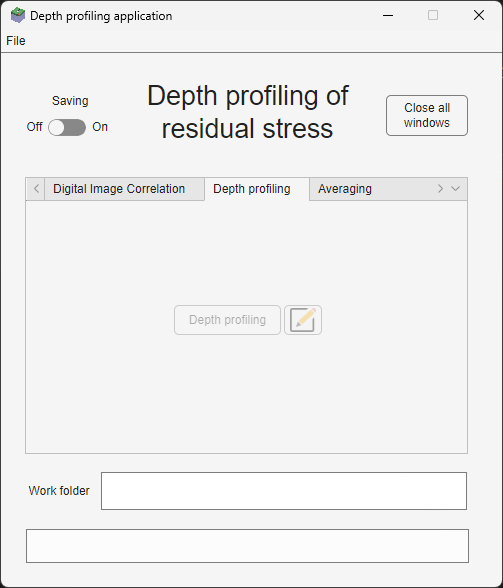</td>
        <td>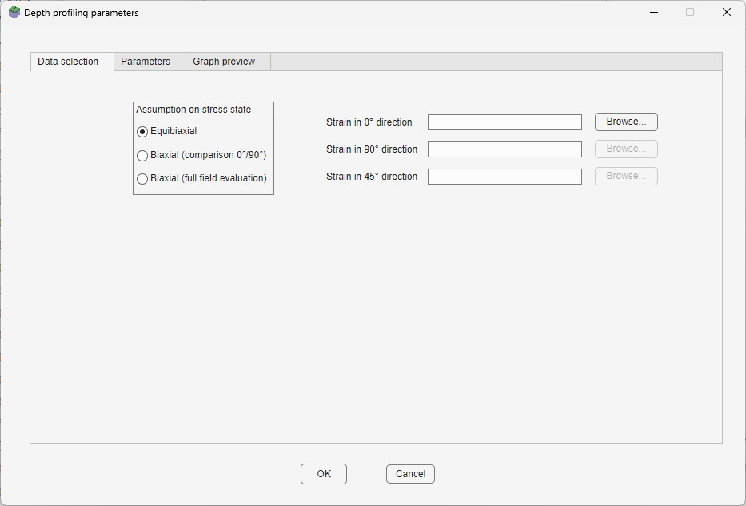</td>
    </tr>
    <tr>
        <td>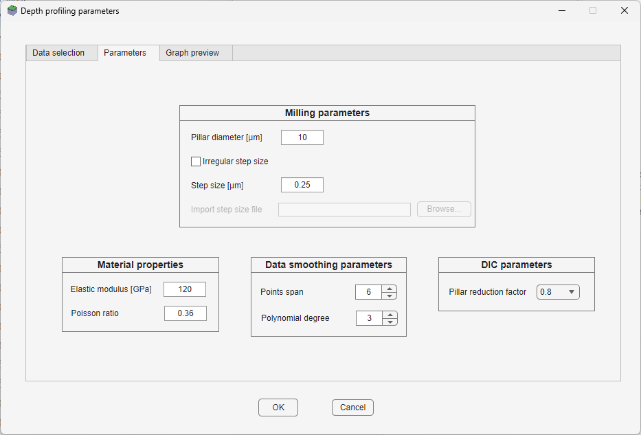</td>
        <td>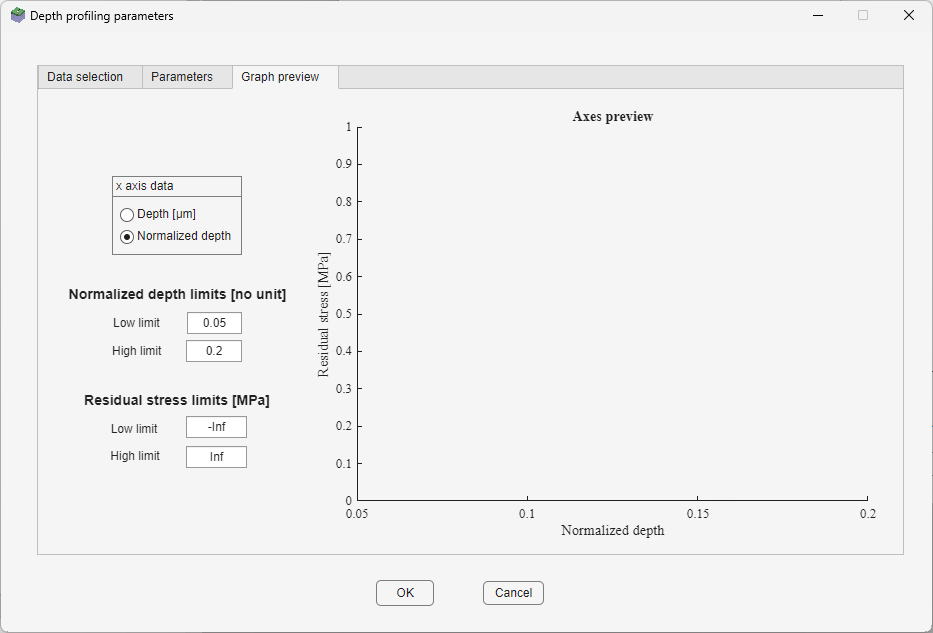</td>
    </tr>
</table>

### Averaging
The functions described here were specifically developed for the analysis of multiple series of pillar milling.

Averaging takes multiple series in input from the *Pillar directory* path (see [Data selection](#data-selection)) and averages the values of residual stress. Standard deviation is also plotted from this averaging.

Stringing allows to plot multiple averaged curves one after the other. The *Succession* option plots all data for one pillar diameter, stops at the last numerical value and plots the next pillar diameter. The *Combination* option will average the plots of two pillar diameters.

<table>
    <tr>
        <td style="width:45%">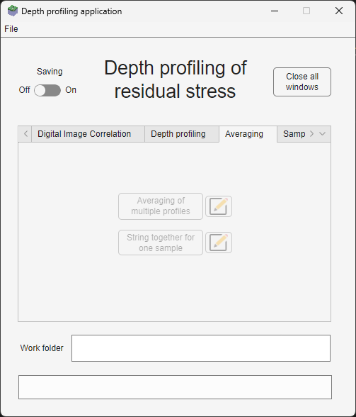</td>
        <td>
            <figure>
                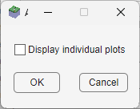
                <figcaption> Averaging parameters </figcaption>
            </figure>
        </td>
        <td>
            <figure>
                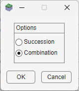
                <figcaption> Stringing parameters </figcaption>
            </figure>
        </td>
    </tr>
</table>

### Comparison
The user can compare two samples for one pillar diameter, or entirely.
<table>
    <tr>
        <td style="width:45%">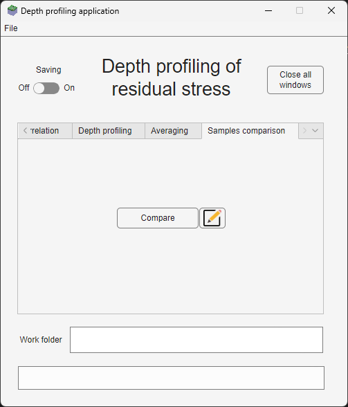</td>
        <td>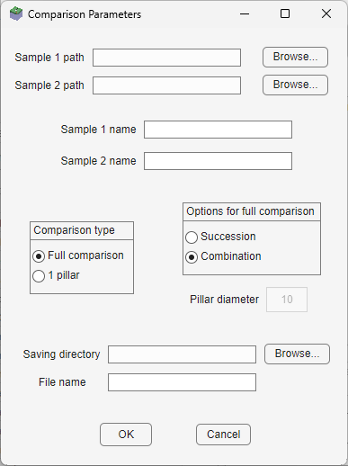</td>
    </tr>
</table>

## Examples
### Case 1: Equibiaxial stress state
Only one set of images is needed in this case.

- During image acquisition, save your images to `sample/pillar/series/raw/0`.
- Set the saving button to `On` if you want your results to be saved.
- Go to `Data selection`.
  - Select your series with the `Browse` button.
  - Set the scan direction to 0°.
- Go to `Image processing`.
  - In the options:
    - Indicate the format of your images.
    - Crop to the dimensions of your images if you need to remove the bottom label.
    - Set the rotation of the images to `None`.
    - Apply relevant filters if needed.
  - Press `Process stack`.
- Go to `Digital Image Correlation`.
  - Generate a file list.
    - In the file list options, indicate whether you want it to be created automatically or manually. If you set this option to manual, indicate the set of images you want to analyze by filling the fields accordingly.
    - Press `Generate file list`.
    - You should see a confirmation that the file list has been created in the message box below the work folder.
  - Create markers and process correlations.
    - Change parameters if needed.
    - Press `Process correlations`.
  - Press `Displacement analysis`.
    - Filter out markers that seem like outliers, using the functions in `Markers -> Clean`.
    - Create a strain file using the functions in `Strain analysis`.
- Go to `Depth profiling`.
  - In the parameters:
    - Set the stress state to `Equibiaxial`.
    - Import the strain file you obtained through the DIC analysis earlier.
    - Indicate the different parameters related to the milling geometry and the properties of your material. If the properties of your sample vary in depth, you can also import a csv file.
    - You can vary the smoothing parameters (used during depth profiling) and the DIC parameters (depends on how you defined your markers during the DIC analysis).
  - Press `Depth profiling`.
- Additional functions:
  - Average multiple profiles if needed.
  - You can also compare your profile to other profiles using the comparison function.

### Case 2: Biaxial stress state with principal directions at 0° and 90°, only one set of images
If the user only has one set of images in the 0° direction, then they can either create new images by rotating the set and performing the full analysis on the new rotated set, or by rotating the markers in the DIC application and performing the strain analysis on those markers.
