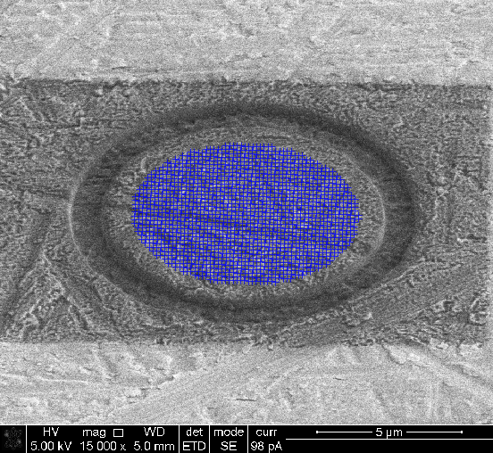
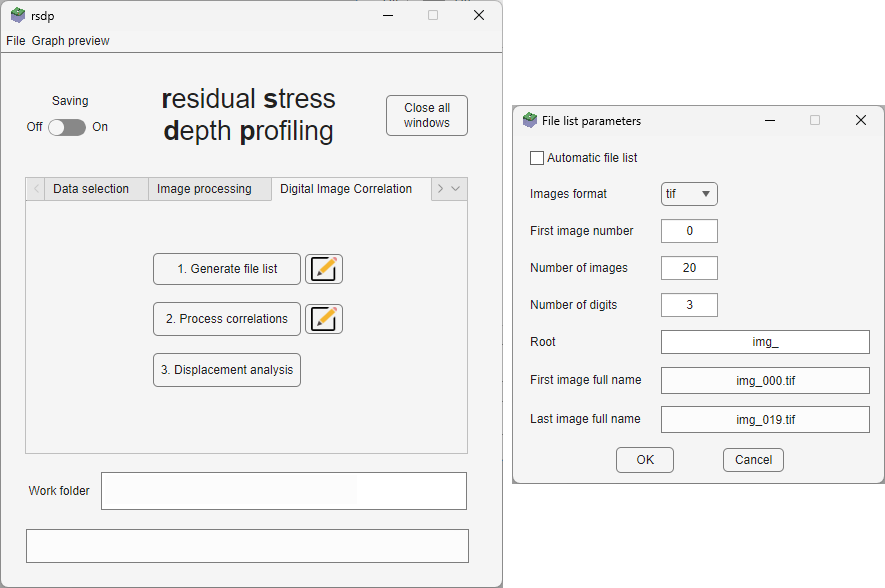

# Summary
Any processing of materials induces residual stresses that remain present in finished components, even in the absence of an externally applied load. Those residual stresses affect the mechanical properties of the material and can cause early failure or, on the contrary, reinforce them and increase their lifespan [@hauk_structural_1997; @withers_residual_2001; @withers_residual_2001-1].

Research efforts in recent years have been directed towards the evaluation of local surface and sub-surface residual stresses at the micro- to nanoscale, which was made possible by the development of the ring-core Focused Ion Beam - Digital Image Correlation (FIB-DIC) technique. This technique enables evaluation of the magnitude of average residual stress within the micropillar gauge volume via incremental milling using a FIB, imaging of the top surface of the micropillar via scanning electron microscopy, DIC analysis on those images to assess incremental strain relief as a function of milling depth and finally fitting of the data to a master curve in order to obtain the total strain relief within the gauge volume. [@korsunsky_focused_2009].

The latest developments of FIB-DIC have led to the possibility of evaluating not just the average residual stress within the gauge volume, but also the variation of residual stress as a function of depth using an eigenstrain approach [@korsunsky_nanoscale_2018; @salvati_generalised_2019], i.e., depth profiling. However, code written in the context of this work has not yet been published although it was used in other articles [@everaerts_nanoscale_2019; @sebastiani_nano-scale_2020].

`rsdp` is a tool that allows researchers to perform their entire FIB-DIC analysis process in one interface and includes those latest developments mentioned above.

# Statement of need
`rsdp` builds up on `DICT`, an open source  MATLAB package that was developed in the context of the iStress project [@senn_digital_2016]. `DICT` enables DIC analysis on a set of images (see \autoref{fig:example-DIC_grid}) and outputs a strain file (see \autoref{fig:examples-SR-RS}) that is then used to calculate the average residual stress of the gauge volume.

{width=70%}

`rsdp` offers the possibility to output a residual stress depth profile (as shown in \autoref{fig:examples-SR-RS}). This is especially useful for materials where a variation of residual stress along depth is expected. `rsdp` includes the possibility to perform an analysis for an equibiaxial stress state (i.e., with the same magnitude of stress in the in-plane directions) and a non-equibiaxial stress state (i.e., where a difference in the magnitude of residual stresses is expected in the in-plane directions).

Moreover, `rsdp` streamlines the entire FIB-DIC analysis by including all of the steps of the process into one interface. This optimizes the analysis of multiple datasets.

# Software design
The philosophy behind the development of `rsdp` relies on two main points: (1) Propose a clear, stepwise analysis process. (2) Limit user prompts.

The first point was achieved by having a tab structure with one step of the process allocated to each tab. The steps of the process are: (1) Data selection. (2) Image processing. (3) DIC analysis. (4) Depth profiling. (5) Additional functions.

The second point was achieved by moving all the user prompts from `DICT` to a parameters window (associated to each tab). This is especially useful for the successive analysis of multiple datasets with the same parameters (see \autoref{fig:tab_dic-filelist_parameters}).

Additional minor changes were made during development, such as the option to create a file list automatically, and different image processing filters among others.

# Research impact statement
As mentioned above, `rsdp` is part of recent research developments of the FIB-DIC technique. It is used in the PhD project of the main developper of the application, and has already produced tangible results that will be used in an upcoming article. Moreover, @guo_dual-variable_2025 recently proposed an improved method to account for high stress gradients, which could be included in `rsdp` in the future, although it needs more experimental validation at this point.

# References
